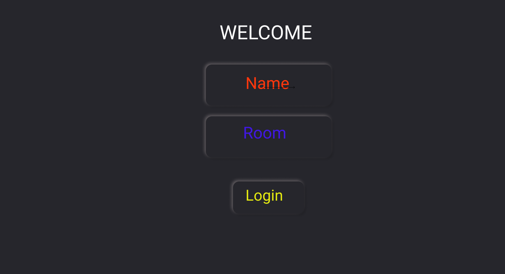

# ASHFIRE
A real time chat application with login and room access features.



### [Live Site](https://realtime-chat-application.netlify.com)

## Introduction
Ever wonder a stack that will solve your problem of client and server connectivity with a ease of control and flexible functionality.

This project will emphasize on client and server connection at another level by making control more adaptable.

Setup:
- run ```npm i && npm start``` for both client and server side to start the development server
